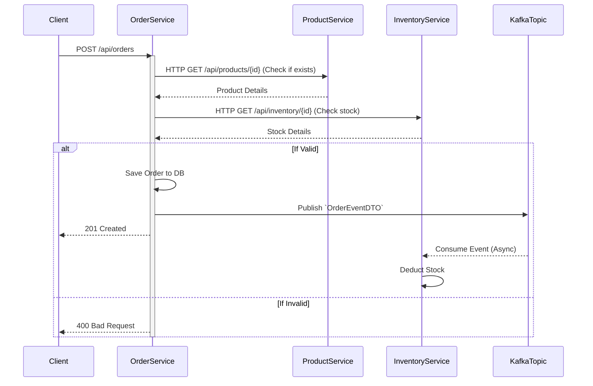

<div align="center">

# 🛍️ Order Management System (Microservices)

[](https://www.oracle.com/java/)
[](https://spring.io/projects/spring-boot)
[](https://spring.io/projects/spring-cloud)
[](https://spring.io/projects/spring-cloud-netflix)
[](https://www.keycloak.org/)
[](https://kafka.apache.org/)
[](https://www.mysql.com/)
[](https://maven.apache.org/)

An enterprise-grade **Order Management System** built using a modern **Microservices Architecture**. It leverages Spring Boot, Spring Cloud, and Kafka for synchronous and asynchronous inter-service communication.

</div>

---

## 📖 Table of Contents
- [Architecture](#-architecture)
- [Modules Overview](#-modules-overview)
- [Technology Stack](#-technology-stack)
- [System Flow](#-system-flow)
- [Getting Started](#-getting-started)
- [Project Structure](#-project-structure)

---

## 🏛 Architecture

The system is designed with multiple independent services following the **Database-per-Service** pattern, ensuring loose coupling and high scalability.

### Core Architecture Components:
- **API Gateway**: Entry point for external clients, routing requests to appropriate services.
- **Service Registry (Eureka)**: Discovery server for dynamic service registration and resolution.
- **Synchronous Communication**: HTTP `WebClient` for immediate validations (e.g., Order -> Inventory/Product).
- **Asynchronous Communication**: `Apache Kafka` for event-driven workflows (e.g., Order Creation Event).

---

## 📦 Modules Overview

| Module | Port | Description |
| :--- | :---: | :--- |
| **`apigateway`** | `8080` (Typical) | The API Gateway that routes traffic to specific microservices. |
| **`discoveryserver`** | `8761` | Netflix Eureka Server for service registration and discovery. |
| **`product`** | `8083` | Manages product catalog and information. Owns its own MySQL DB. |
| **`inventory`** | `8082` | Manages stock and item availability. Consumes Kafka events. |
| **`order`** | `8081` | Accepts orders, orchestrates validation, and publishes events via Kafka. |
| **`base`** | N/A | Shared library module containing common DTOs (e.g., `OrderEventDTO`). |

---

## 💻 Technology Stack

### Backend & Frameworks
- **Java 17**: Core programming language.
- **Spring Boot 4.1.0**: Rapid application development framework.
- **Spring Cloud 2025.1.2**: Microservices tooling (Eureka, Gateway).
- **Spring Data JPA**: For database interactions and ORM.
- **Spring Web MVC**: For building RESTful APIs.

### Databases & Messaging
- **MySQL**: Relational database for persistent storage (Product, Order, Inventory).
- **H2 Database**: In-memory database for testing and rapid development.
- **Apache Kafka**: Distributed event streaming platform for async communication.

### Tools & Utilities
- **Lombok**: Reduces boilerplate code (Getters, Setters, Constructors).
- **ModelMapper**: For mapping between Entity and DTO objects.
- **Maven**: Dependency management and build tool.

---

## 🔄 System Flow

The order creation process integrates both REST and Event-Driven paradigms:



---

## 🚀 Getting Started

### Prerequisites
- **JDK 17** installed.
- **Maven** installed.
- **MySQL Server** running.
- **Apache Kafka & Zookeeper** running locally or via Docker.

### Installation & Setup

1. **Clone the repository** (if applicable):
   ```bash
   git clone <repository-url>
   cd "Order Management System"
   ```

2. **Database Setup**:
   Ensure your local MySQL instance is running and create the respective databases for the services (e.g., `product_db`, `order_db`, `inventory_db`) as configured in the `application.properties` of each service.

3. **Start Infrastructure Services**:
   - Start **Zookeeper** & **Kafka**.
   - Navigate to `Microservices/discoveryserver` and run it.
   - Navigate to `Microservices/apigateway` and run it.

4. **Build the Project**:
   From the root `Microservices` directory, run:
   ```bash
   mvn clean install
   ```

5. **Run the Microservices**:
   Run the remaining services (`product`, `inventory`, `order`) using Maven or your IDE:
   ```bash
   mvn spring-boot:run -pl product
   mvn spring-boot:run -pl inventory
   mvn spring-boot:run -pl order
   ```

---

## 📂 Project Structure

The project follows a standard multi-module Maven layout and a clean layered architecture for each microservice:

```text
Model → DTO → Repository → Service → Controller
```

- **`model/`**: JPA Entities (`@Entity`).
- **`dto/`**: Data Transfer Objects for API boundaries.
- **`repo/`**: Spring Data repositories (`JpaRepository`).
- **`service/`**: Business logic (`@Service`).
- **`controller/`**: REST API endpoints (`@RestController`).

---
